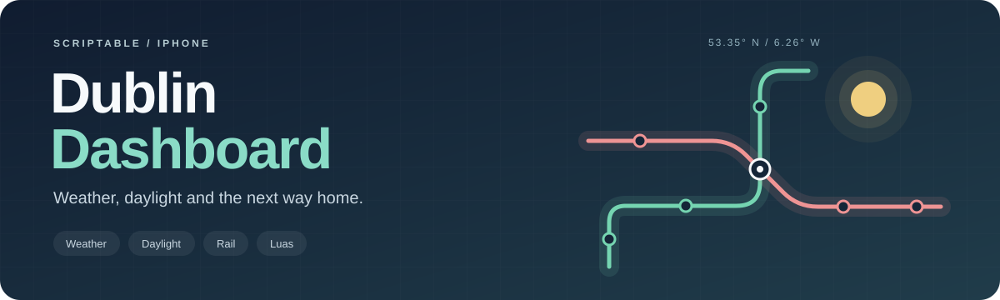

  

  
  
  

# Dublin Dashboard

A large iPhone widget for the free Scriptable app. Shows Dublin weather from Yr,
a daylight scale and countdown, today's qualifying direct Irish Rail trains,
and up to 5 Parnell Green Line trams, each with a connecting Abbey Street
Red Line tram toward The Point or Connolly.

## Set up on your phone

1. Open `Dublin Dashboard.js` in this repository and choose **Raw**.
2. Copy the entire small loader script.
3. In Scriptable, open your existing **Dublin Dashboard** script.
4. Replace its contents with the loader and press the run button while online.
5. Keep the large widget selected to use **Dublin Dashboard**.

The phone downloads `dashboard.js` from this repository's `main` branch each time
the widget runs. If GitHub is unreachable or returns invalid JavaScript, it uses
the saved copy. The first run needs an internet connection. The loader checks
syntax before saving; a runtime bug in an update still needs correcting or
reverting in Git.

## Licence and credits

Original project code, documentation and banner are [MIT licensed](LICENSE).
You can use, modify, share and sell them, provided you keep the licence notice.
The SunCalc-derived solar calculation is BSD-2-Clause licensed. Third-party
weather and transport data retain their own terms; see [NOTICE.md](NOTICE.md)
for providers, source links, licence links and modification notices.

| Information | Credit |
| --- | --- |
| Weather | [MET Norway](https://www.met.no/en/free-meteorological-data/Licensing-and-crediting), retrieved from [Yr](https://www.yr.no/en/forecast/daily-table/2-2964574/Ireland/Leinster/Dublin%20City/Dublin), a MET Norway/NRK service; MET data policy offers CC BY 4.0 / NLOD 2.0 |
| Daylight | Calculated on the phone using an adaptation of [SunCalc](https://github.com/mourner/suncalc), by Volodymyr Agafonkin; BSD-2-Clause |
| Rail timetable | [National Transport Authority / TFI](https://www.transportforireland.ie/transitData/PT_Data.html); CC BY 4.0 |
| Rail predictions | [Iarnród Éireann / Irish Rail](https://api.irishrail.ie/realtime/); provider's API terms, with no named licence asserted |
| Luas predictions | [Transport Infrastructure Ireland](https://data.gov.ie/dataset/luas-forecasting-api); CC BY 4.0 |

The Yr integration reads weather values from its public webpage to preserve
Yr's displayed feels-like temperature. It is an unofficial integration;
[Yr's supported data-access guidance](https://hjelp.yr.no/hc/en-us/articles/360001946134-Data-access-and-terms-of-service)
directs developers to MET's API. MET's data licence does not establish permission
to reuse the whole Yr website. This project does not copy Yr's images or logos.

NTA timetable data is supplied as-is; the NTA is not responsible for errors or
inaccuracies. No data provider endorses this independent project.
